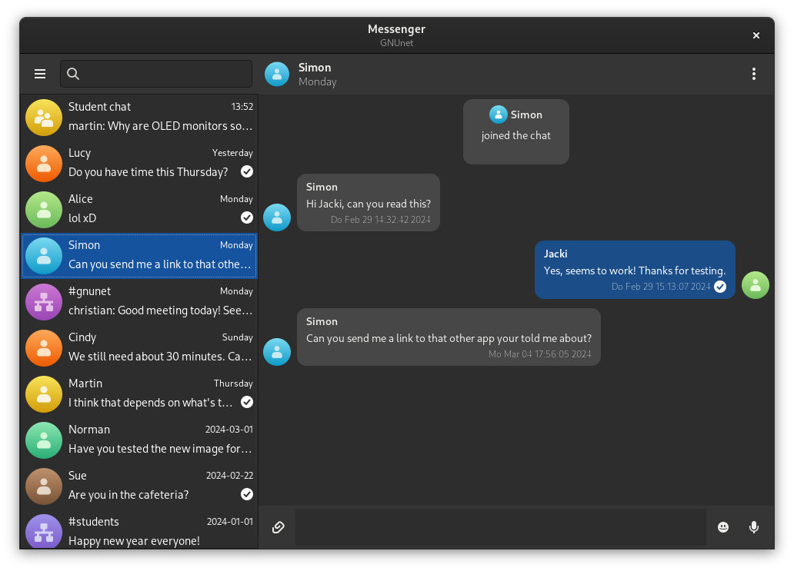

# Messenger-GTK

A GTK based GUI for the Messenger service of GNUnet.

[](https://snapcraft.io/messenger-gtk)



## Features

Messenger-GTK is a convergent GTK messaging application using the GNUnet Messenger service. The goal is to provide private and secure communication between any group of devices.

The application provides the following features:

 - Creating direct chats and group chats
 - Managing your contacts and groups
 - Invite contacts to a group
 - Sending text messages
 - Sending voice recordings
 - Sharing files privately
 - Deleting messages with any custom delay
 - Renaming, tagging or blocking contacts
 - Exchanging contact details physically
 - Verifying contact identities
 - Switching between different accounts

Chats will generally created as opt-in. So you can decide who may contact you directly and who does not, accepting to a direct chat. Leaving a chat is also always possible.

## Build & Installation

The following dependencies are required and need to be installed to build the application:

 - [gnunet](https://git.gnunet.org/gnunet.git/): For using general GNUnet datatypes
 - [libgnunetchat](https://git.gnunet.org/libgnunetchat.git/): For chatting via GNUnet messenger
 - [gtk3](https://gitlab.gnome.org/GNOME/gtk): For the general UI design
 - [libhandy](https://gitlab.gnome.org/GNOME/libhandy): For responsive UI widgets
 - [libnotify](https://gitlab.gnome.org/GNOME/libnotify): For notifications
 - [qrencode](https://github.com/fukuchi/libqrencode): For generating QR codes to share credentials
 - [gstreamer](https://gitlab.freedesktop.org/gstreamer): For recording and playing voice messages
 - [pipewire](https://gitlab.freedesktop.org/pipewire/pipewire): For capturing images from camera sensors
 - [libportal](https://github.com/flatpak/libportal): For requesting permission to use certain system features

As additional step you will need to load all required git submodules via `git submodule init` and `git submodule update`. It is also possible to just add the `--recursive` flag while cloning the repository to do that automatically.

Here is the list of the used submodules:

 - [gnome-characters](https://gitlab.gnome.org/GNOME/gnome-characters): For the emoji picker

Then you can simply use [Meson](https://mesonbuild.com/) as follows:
```
meson build            # Configure the build files for your system
ninja -C build         # Build the application using those build files
ninja -C build install # Install the application
```

Here is a list of some useful build commands using Meson and [Ninja](https://ninja-build.org/):

 - `meson compile -C build` to just compile everything with configured parameters
 - `rm -r build` to cleanup build files in case you want to recompile
 - `meson install -C build` to install the compiled files (you might need sudo permissions to install)
 - `meson dist -C build` to create a tar file for distribution

If you want to change the installation location, use the `--prefix=` parameter in the initial meson command. Also you can enable optimized release builds by adding `--buildtype=release` as parameter.

## Runtime

The application will utilize gstreamer to scan a video feed from your camera for QR codes to add new contacts conveniently, record audio messages, stream audio/video live in a discourse dialog or simply play transferred media files. These feature require some gstreamer plugins to be installed:

 - [appsrc](https://gstreamer.freedesktop.org/documentation/app/appsrc.html?gi-language=c)
 - [aspectratiocrop](https://gstreamer.freedesktop.org/documentation/videocrop/aspectratiocrop.html?gi-language=c)
 - [audioconvert](https://gstreamer.freedesktop.org/documentation/audioconvert/index.html?gi-language=c)
 - [audiomixer](https://gstreamer.freedesktop.org/documentation/audiomixer/audiomixer.html?gi-language=c)
 - [autoaudiosink](https://gstreamer.freedesktop.org/documentation/autodetect/autoaudiosink.html?gi-language=c)
 - [autoaudiosrc](https://gstreamer.freedesktop.org/documentation/autodetect/autoaudiosrc.html?gi-language=c)
 - [avdec_h264](https://gstreamer.freedesktop.org/documentation/libav/avdec_h264.html?gi-language=c)
 - [capsfilter](https://gstreamer.freedesktop.org/documentation/coreelements/capsfilter.html?gi-language=c)
 - [fdsink](https://gstreamer.freedesktop.org/documentation/coreelements/fdsink.html?gi-language=c)
 - [gtksink](https://gstreamer.freedesktop.org/documentation/gtk/gtksink.html?gi-language=c)
 - [oggdemux](https://gstreamer.freedesktop.org/documentation/ogg/oggdemux.html?gi-language=c)
 - [oggmux](https://gstreamer.freedesktop.org/documentation/ogg/oggmux.html?gi-language=c)
 - pipewiresrc
 - [playbin](https://gstreamer.freedesktop.org/documentation/playback/playbin.html?gi-language=c)
 - [queue](https://gstreamer.freedesktop.org/documentation/coreelements/queue.html?gi-language=c)
 - [rtph264depay](https://gstreamer.freedesktop.org/documentation/rtp/rtph264depay.html?gi-language=c)
 - [rtph264pay](https://gstreamer.freedesktop.org/documentation/rtp/rtph264pay.html?gi-language=c)
 - [rtpjitterbuffer](https://gstreamer.freedesktop.org/documentation/rtpmanager/rtpjitterbuffer.html?gi-language=c)
 - [rtpL16depay](https://gstreamer.freedesktop.org/documentation/rtp/rtpL16depay.html?gi-language=c)
 - [rtpL16pay](https://gstreamer.freedesktop.org/documentation/rtp/rtpL16pay.html?gi-language=c)
 - [rtpmux](https://gstreamer.freedesktop.org/documentation/rtpmanager/rtpmux.html?gi-language=c)
 - [tee](https://gstreamer.freedesktop.org/documentation/coreelements/tee.html?gi-language=c)
 - [videoconvert](https://gstreamer.freedesktop.org/documentation/videoconvertscale/videoconvert.html?gi-language=c)
 - [videoscale](https://gstreamer.freedesktop.org/documentation/videoconvertscale/videoscale.html?gi-language=c)
 - [volume](https://gstreamer.freedesktop.org/documentation/volume/index.html?gi-language=c)
 - [vorbisdec](https://gstreamer.freedesktop.org/documentation/vorbis/vorbisdec.html?gi-language=c)
 - [vorbisenc](https://gstreamer.freedesktop.org/documentation/vorbis/vorbisenc.html?gi-language=c)
 - [x264enc](https://gstreamer.freedesktop.org/documentation/x264/index.html?gi-language=c)
 - [zbar](https://gstreamer.freedesktop.org/documentation/zbar/index.html?gi-language=c)

Install packages depending on your distribution to be able to use those plugins.

## Contribution

If you want to contribute to this project as well, the following options are available:

 * Contribute directly to the [source code](https://git.gnunet.org/messenger-gtk.git/) with patches to fix issues, implement new features or improve the usability.
 * Open issues in the [bug tracker](https://bugs.gnunet.org/bug_report_page.php) to report bugs, issues or missing features.
 * Contact the authors of the software if you need any help to contribute (testing is always an option).

The list of all previous authors can be viewed in the provided [file](AUTHORS).
