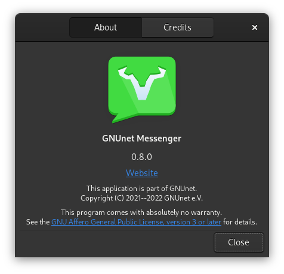
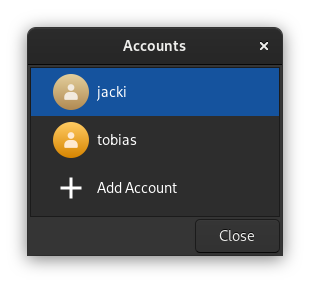
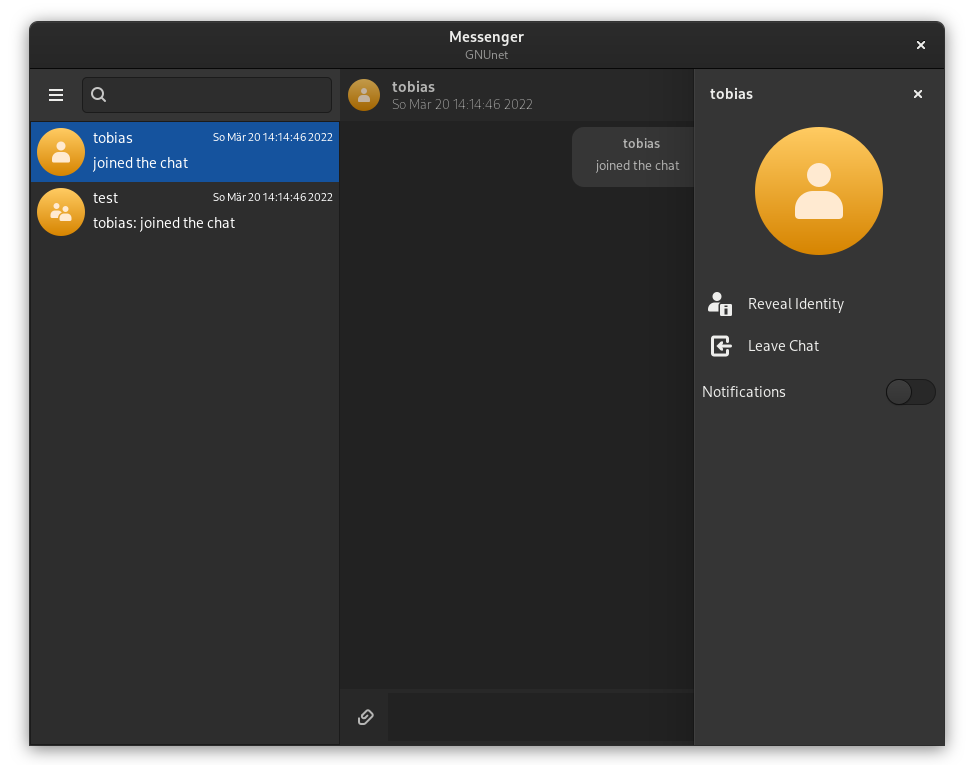
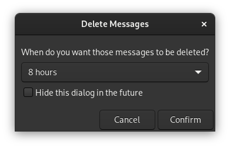
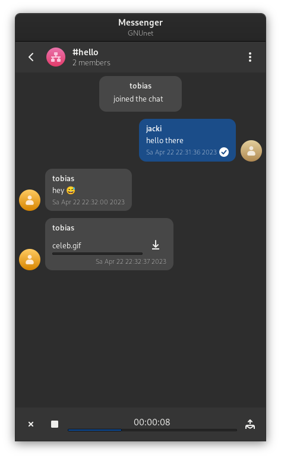

# Messenger-GTK

A GTK based GUI for the Messenger service of GNUnet.







## Features

Messenger-GTK is a convergent GTK messaging application using the GNUnet Messenger service. The goal is to provide private and secure communication between any group of devices.

The application provides the following features:

 - Creating direct chats and group chats
 - Managing your contacts and groups
 - Invite contacts to a group
 - Sending text messages
 - Sending voice recordings
 - Sharing files privately
 - Deleting messages with any custom delay
 - Renaming contacts
 - Exchanging contact details physically
 - Verifying contact identities
 - Switching between different accounts

Chats will generally created as opt-in. So you can decide who may contact you directly and who does not, accepting to a direct chat. Leaving a chat is also always possible.

## Build & Installation

The following dependencies are required and need to be installed to build the application:

 - [gnunet](https://git.gnunet.org/gnunet.git/): For using general GNUnet datatypes
 - [libgnunetchat](https://git.gnunet.org/libgnunetchat.git/): For chatting via GNUnet messenger
 - [gtk3](https://gitlab.gnome.org/GNOME/gtk): For the general UI design
 - [libhandy](https://gitlab.gnome.org/GNOME/libhandy): For responsive UI widgets
 - [libnotify](https://gitlab.gnome.org/GNOME/libnotify): For notifications
 - [qrencode](https://github.com/fukuchi/libqrencode): For generating QR codes to share credentials
 - [zbar](https://github.com/mchehab/zbar): For scanning QR codes via camera
 - [gstreamer](https://gitlab.freedesktop.org/gstreamer): For recording and playing voice messages

As additional step you will need to load all required git submodules via `git submodule init` and `git submodule update`. It is also possible to just add the `--recursive` flag while cloning the repository to do that automatically.

Here is the list of the used submodules:

 - [gnome-characters](https://gitlab.gnome.org/GNOME/gnome-characters): For the emoji picker

Then you can simply use [Autotools](https://www.gnu.org/software/automake/) as follows:
```
./bootstrap        # Generate the configure script
./configure        # Configure the Makefiles for your system
make               # Build the library using the Makefiles
sudo make install  # Install the library
```

Here is a list of some useful build targets in the Makefile:

 - `make` to just compile everything with default parameters
 - `make clean` to cleanup build files in case you want to recompile
 - `make install` to install the compiled files (you might need sudo permissions to install)

If you want to change the installation location, use the `--prefix=` parameter in the `configure` script. Also you can enable debugging builds by adding `--enable-debug` as parameter when running the `configure` script.

## Contribution

If you want to contribute to this project as well, the following options are available:

 * Contribute directly to the [source code](https://git.gnunet.org/messenger-gtk.git/) with patches to fix issues, implement new features or improve the usability.
 * Open issues in the [bug tracker](https://bugs.gnunet.org/bug_report_page.php) to report bugs, issues or missing features.
 * Contact the authors of the software if you need any help to contribute (testing is always an option).

The list of all previous authors can be viewed in the provided [file](AUTHORS).
